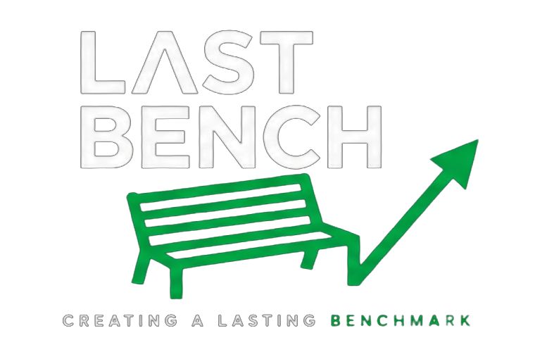

<p align="center">
  
</p>

<h1 align="center">Last Bench</h1>

<p align="center"><strong>We help Bangladeshi students study, settle and succeed in Malaysia.</strong></p>

<p align="center">
  A student-first digital journey platform for clearer decisions, transparent progress, verified guidance and community support.
</p>

<p align="center">
  <a href="https://github.com/lets-colab/LastBenchBd/actions/workflows/ci.yml"></a>
</p>

---

## At a glance

|                     |                                                                 |
| ------------------- | --------------------------------------------------------------- |
| **Product**         | Bangladesh → Malaysia student journey platform                  |
| **Experience**      | Marketing site at `/` + student application at `/app`           |
| **Frontend**        | Expo Router · React Native · React · TypeScript                 |
| **API**             | Express · tRPC                                                  |
| **Data**            | Drizzle ORM · Supabase Postgres                                 |
| **Web deployment**  | Netlify                                                         |
| **API deployment**  | Render                                                          |
| **Repository**      | `lets-colab/LastBenchBd`                                        |
| **Release posture** | Active development; production must pass the release gate below |

> **Product truth is a feature.** Last Bench must never present fabricated admissions data, fake progress, placeholder metrics or AI guesses as real student guidance.

---

## Why Last Bench exists

Studying abroad is not one decision. It is a chain of decisions: university discovery, eligibility, documents, applications, visas, communication, arrival and what happens after admission.

Last Bench is being built to make that journey understandable.

The product is not designed as a traditional education-consultancy website. It is a student-first system that should always answer three questions:

1. **Where am I now?**
2. **What happens next?**
3. **Who can help when the answer needs a human?**

### Product principles

- **Clarity first** — the next action should be obvious.
- **Trust through transparency** — distinguish verified facts, system state, AI guidance and human updates.
- **Mentor-like guidance** — direct, supportive and human; never corporate or patronizing.
- **Mobile first** — designed for real student devices and imperfect connections.
- **Community over transaction** — the relationship should continue beyond admission.

For deeper product and brand context, read [`PRODUCT.md`](./PRODUCT.md), [`design.md`](./design.md) and [`AGENT.md`](./AGENT.md).

---

## The product system

This repository contains one connected platform rather than separate disconnected projects.

| Surface                  | Role                                                                              | Location                                    |
| ------------------------ | --------------------------------------------------------------------------------- | ------------------------------------------- |
| **Marketing experience** | Story, trust, lead capture and entry into the student journey                     | `landing/`                                  |
| **Student app**          | Dashboard, applications, universities, messages, community, AI Guides and profile | `app/`                                      |
| **[CLASS(Λ)]**           | Build-first programme overview, free masterclass and full-course registration     | `landing/class-lambda/`, `landing/class-a/` |
| **co.lab**               | Connected brand, product and venture pathway with human-scoped contact            | `landing/colab/`                            |
| **API**                  | Authenticated product and business logic                                          | `server/`                                   |
| **Database**             | Product schema and reviewed migrations                                            | `drizzle/`                                  |
| **Shared logic**         | Cross-surface types and business logic                                            | `shared/`                                   |
| **Design system**        | Product visual and interaction standards                                          | `design-system/`, `design.md`               |
| **Tests**                | Auth, privacy, matching, CORS, AI and product verification                        | `tests/`                                    |

The web build is intentionally unified:

```text
www.lastbenchbd.com/
├── /              → marketing experience
├── /app           → student application
├── /class-lambda  → programme overview
├── /class-a       → current class choices and registration
└── /colab         → connected venture pathway
```

---

## What is already built

### Student journey

- Profile and onboarding
- Journey dashboard connected to backend data
- Multi-stage application tracking
- Application detail, timeline, mentor notes and document metadata
- University discovery and comparison
- Malaysia university dataset used by product logic
- Notifications and notification settings

### Guidance and community

- Three AI Guides representing **Sayem, Fahim and Erfan**
- Guide-specific persistent chat history
- Shared student memory for AI guidance
- Two-way messaging and conversation threads
- Community and cohort experiences

### Operations

- Tutor referral flows
- Commission and payout flows
- Admin views for students, applications, tutors, payouts and analytics
- Lead form with explicit WhatsApp consent and Bangladesh phone validation

### Trust and resilience

- Real loading, empty, error and service-unavailable states
- Privacy-bounded diagnostics / self-healing support
- Automated TypeScript, lint, test, production-build and critical dependency-audit checks in CI
- Grounding rules for AI-generated university guidance

### AI guidance rule

AI guidance must remain grounded in verified project data. Do not invent or imply certainty around acceptance rates, current fees, rankings, visa probability, scholarships, eligibility or other high-stakes facts. When current verification or professional judgment is required, escalate to a human mentor.

---

## Architecture

```text
landing/                 Static marketing experience
app/                     Expo Router student, tutor and admin UI
components/              Shared UI components
hooks/                   React hooks
lib/                     Client/shared libraries
server/                  Express + tRPC API
server/db.ts             Database access layer
server/routers.ts        Product/API procedures
server/self-healing.ts   Redacted diagnostics + safe retry/advisory logic
drizzle/                 Postgres schema + migrations
shared/                  Shared business logic and types
design-system/           Design-system resources
scripts/                 Build, validation and utility scripts
tests/                   Vitest test suite
```

### Core stack

`Expo 54` · `React Native 0.81` · `React 19` · `Expo Router 6` · `TypeScript 5.9` · `NativeWind` · `TanStack Query` · `tRPC 11` · `Express` · `Drizzle ORM` · `PostgreSQL / Supabase` · `Vitest` · `pnpm 9.12`

---

## Quick start

### Prerequisites

- Node.js 20 is the CI baseline
- `pnpm` 9.12.x
- Required environment configuration from `.env.example`

### Install

```bash
git clone https://github.com/lets-colab/LastBenchBd.git
cd LastBenchBd
pnpm install
cp .env.example .env
```

Supply your own local environment values. **Never commit real credentials.**

### Run the application and API

```bash
pnpm dev
```

Or run surfaces separately:

```bash
pnpm dev:server
pnpm dev:metro
pnpm android
pnpm ios
```

---

## Commands

| Command                                    | Purpose                                                                   |
| ------------------------------------------ | ------------------------------------------------------------------------- |
| `pnpm dev`                                 | Run API + Expo development processes                                      |
| `pnpm check`                               | TypeScript verification                                                   |
| `pnpm lint`                                | ESLint verification                                                       |
| `pnpm test`                                | Vitest suite                                                              |
| `pnpm build`                               | Build production API bundle to `server-dist/`                             |
| `pnpm build:web`                           | Assemble the combined local web artifact in `dist/`                       |
| `pnpm build:web:production`                | Validate public environment configuration + build production web artifact |
| `pnpm audit --prod --audit-level critical` | Block critical production dependency findings                             |
| `pnpm db:push`                             | Generate + migrate DB changes — **never point blindly at production**     |
| `pnpm qr`                                  | Generate a project QR code                                                |

---

## Verification contract

A change is not complete because it compiles. Before merging or releasing, verify it.

```bash
pnpm install --frozen-lockfile
pnpm check
pnpm lint
pnpm test
pnpm audit --prod --audit-level critical
pnpm build
pnpm build:web
```

For the production web build path:

```bash
pnpm build:web:production
```

The production build intentionally rejects missing, insecure or placeholder public configuration.

---

## Production topology

| Layer               | Platform              | Contract                             |
| ------------------- | --------------------- | ------------------------------------ |
| Marketing + web app | **Netlify**           | `/` = landing · `/app` = student app |
| API                 | **Render**            | Express/tRPC runtime                 |
| Database            | **Supabase Postgres** | Product data                         |
| Canonical web host  | `www.lastbenchbd.com` | Netlify custom domain                |
| Canonical API host  | `api.lastbenchbd.com` | Render custom domain                 |

Netlify is the supported web deployment for this repository. Render is the supported API runtime.

### Release gate

Repository configuration or a green CI badge alone does **not** prove production is live.

Before calling a release complete, verify:

- [ ] Required `EXPO_PUBLIC_*` values are configured in Netlify
- [ ] Required server values are configured in Render
- [ ] Reviewed production database migrations are applied
- [ ] `www.lastbenchbd.com` resolves to the intended Netlify site
- [ ] `api.lastbenchbd.com` resolves to the intended Render service
- [ ] API health check succeeds
- [ ] `/` succeeds
- [ ] `/app/` succeeds
- [ ] Fresh-browser login and logout succeed
- [ ] Returning-session authentication succeeds
- [ ] A real authenticated API request succeeds
- [ ] A real lead submission is received and follow-up is verified
- [ ] Document/storage authorization is verified before opening full upload flows

Detailed release instructions live in [`AGENT.md`](./AGENT.md).

---

## Brand system

Canonical brand resources live under [`assets/branding/`](./assets/branding/) and production logo assets under [`landing/assets/`](./landing/assets/).

Approved brand assets are source assets:

- Do not redraw or approximate the logo
- Do not regenerate approved marks with AI
- Do not distort proportions
- Do not recolor outside approved variants
- Preserve clear space and visual hierarchy

Current documented palette:

| Token       | Value     |
| ----------- | --------- |
| Brand Green | `#00C853` |
| Charcoal    | `#111111` |
| Warm White  | `#FAFAF8` |
| Sage        | `#E6F2E9` |
| Gray        | `#6B6F76` |

The intended direction is cinematic, sincere and forward-moving — never generic education-agency design and never charity/pity framing.

---

## Engineering guardrails

- Use conventional commits: `feat:`, `fix:`, `docs:`, `build:`, etc.
- Never ship hardcoded demo values disguised as real data
- Verify behavior empirically; do not infer production health from source alone
- Keep database changes deliberate and reviewed
- Never auto-create or auto-alter production tables during normal server startup
- New data-backed features should follow: **schema → DB helper → tRPC procedure → UI → tests**
- Surface known gaps rather than hiding them
- Treat authentication, documents, commissions, student records and AI guidance as high-trust surfaces

---

## Documentation map

| Document                                                       | Purpose                                                 |
| -------------------------------------------------------------- | ------------------------------------------------------- |
| [`README.md`](./README.md)                                     | Repository front door, architecture and release posture |
| [`AGENT.md`](./AGENT.md)                                       | Detailed engineering/AI-agent operating manual          |
| [`AGENTS.md`](./AGENTS.md)                                     | Additional agent instructions                           |
| [`PRODUCT.md`](./PRODUCT.md)                                   | Product and brand definition                            |
| [`design.md`](./design.md)                                     | Product design system and interaction rules             |
| [`DESIGN_AUDIT_AND_REBUILD.md`](./DESIGN_AUDIT_AND_REBUILD.md) | Design audit and rebuild record                         |
| [`MESSAGING_FEATURES.md`](./MESSAGING_FEATURES.md)             | Messaging implementation documentation                  |
| [`todo.md`](./todo.md)                                         | Working backlog; not proof of completion                |

### Source-of-truth order

When documentation disagrees:

1. **Current code + verified runtime behavior**
2. **README**
3. **AGENT.md**
4. **PRODUCT.md / design.md**
5. Feature-specific documentation
6. `todo.md`

> Some older internal documentation still references an earlier repository name. The active repository is **`lets-colab/LastBenchBd`**. Treat older names as documentation drift, not canonical identity.

---

## Current priority

Before adding more surface area, prioritize production trust:

1. Complete and verify Netlify + Render production configuration
2. Apply and verify required database migrations
3. Verify same-site authentication end to end
4. Verify real lead capture and follow-up
5. Verify document/storage authorization
6. Triage remaining non-critical dependency advisories
7. Keep university and admissions data current, attributable and reviewable

---

<p align="center">
  <strong>Last Bench</strong><br />
  From uncertainty to a clear next step.
</p>
